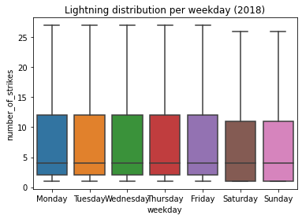
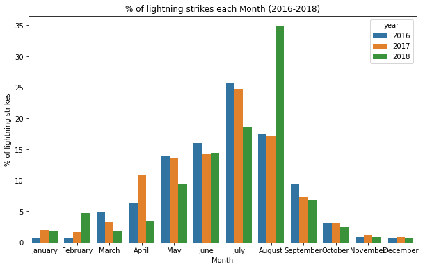

# NOAA Lightning Strike EDA (Python)

## Overview

This project explores lightning strike data from NOAA to identify patterns across locations, weekdays, and months. The focus is on structuring raw data and extracting insights using Python.

## Key Questions

* Which locations experience the highest lightning activity?
* Which locations have lightning most frequently?
* Do certain days of the week have more lightning strikes?
* Which months contribute the most to yearly lightning activity?

## Tools Used

* Python (pandas, NumPy)
* Seaborn & Matplotlib
* Jupyter Notebook

## Key Steps

* Converted date column to datetime format
* Checked for duplicates
* Sorted and filtered data
* Created new features (weekday, week, month, year)
* Grouped data using `groupby()`
* Combined datasets using `concat()`
* Merged data using `merge()`
* Calculated monthly lightning percentages
## Visualizations

### Lightning Distribution by Weekday

### Monthly Lightning Percentage

## Key Insight

Lightning activity is not evenly distributed across the year.
August consistently shows the highest percentage of lightning strikes, especially in 2018.

## Files

* `lightning_eda_structuring.ipynb` → Full analysis notebook

## Author

Tshianeo Eadith Mulaudzi

